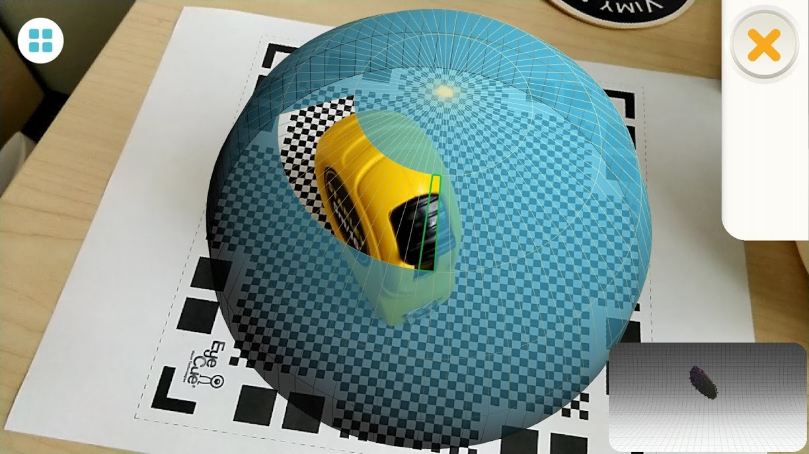
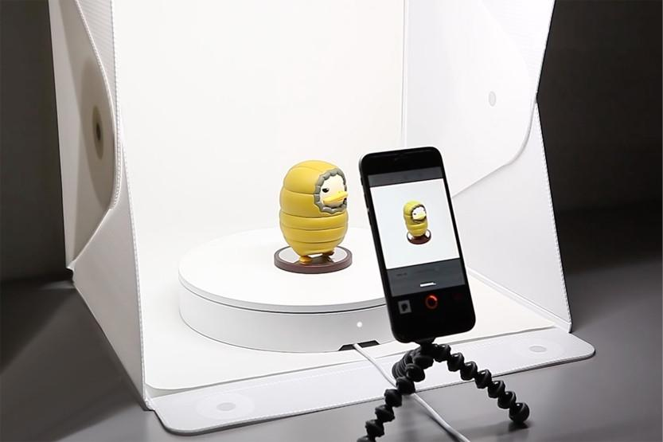
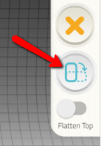
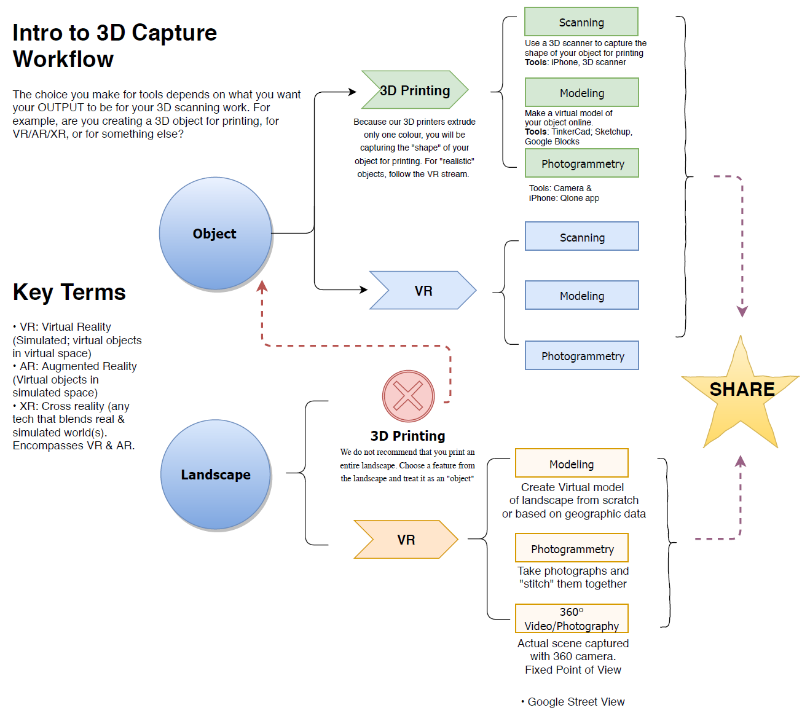

# 3D Scanning With Qlone Quick Tips

1.  **AR Dome Keeps Disappearing:**
    
    
    
    -   If the AR dome disappears, one of the most common reasons for this is that the app cannot see at least three of the four corners of the checkered scanning mat.
    -   Move back from the scanning mat, and the AR dome should reappear once at least three corners are in view.
2.  **Low-Quality Scans:**
    
    
    
    -   **Slow Down:** Consider slowing down how quickly you are moving around the object. Completely scan each layer before moving on to another layer.
    -   **Lighting:** Also consider the lighting where you are doing the scanning. Ideally, you’ll have two bright light sources pointed at the scanning area from opposite directions.
    -   **Tripod & Rotating Turntable:** Having something steady your camera while scanning can be helpful, especially when combined with a turntable. If the object is unstable on the turntable, you might want to secure the base of the object with tape.
    
    
    
    -   **Second Scan with Different Orientation:** Another trick is to make sure that you do a second scan with a different orientation of the object immediately after the first scan. This is done by pressing the Blue Button on the right side of the screen after your first scan is complete.
    -   **Shiny Objects:** Shiny objects don’t tend to scan well because they reflect light, and Qlone struggles with reflected light.
    
    

[NEXT STEP: The Basics](act-2.html){: .btn .btn-blue }
