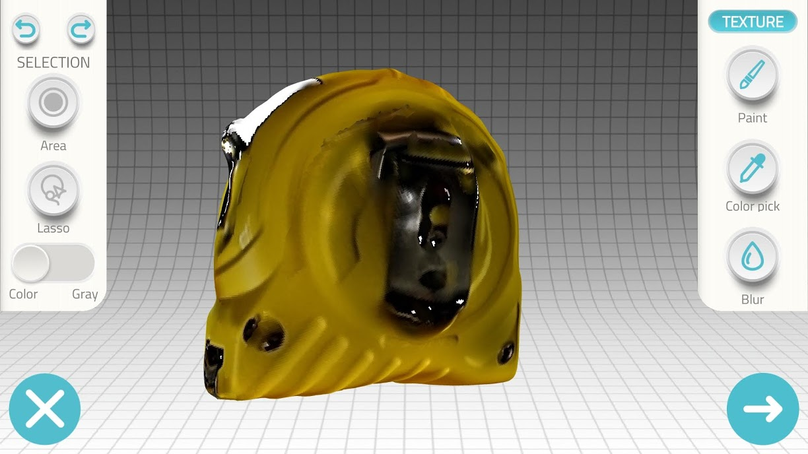

# In-Class Activity: The Basics

If you have any questions or get stuck as you work through this in-class exercise, please ask the instructor for assistance. Enjoy!

1.  If you haven’t already, please [download and install](https://www.qlone.pro){:target="_blank"} Qlone on your iPhone or Android phone.
2.  Pick up one of the provided checkered scanning mats (like the one pictured above right). If you are at home you can [download and print](http://bit.ly/2FV4mG9){:target="_blank"} your own scanning mat.
3.  Scan a small object (less than 10 x 10 cm):
    
    
    
    -   Select a small object and place in the center of the scanning mat.  Note: To scan a larger object, you need a larger scanning mat which can be printed on a large format printer.
    -   Launch Qlone on your phone.
    -   Press the blue **“+”** button in the bottom right corner of the screen.
    -   You should now be seeing an Augmented Reality (AR) dome on top of the object you are going to scan.
    
    
    
    -   Start scanning by pressing the **Red Record** button in the top right of the screen.
    -   You now need to either slowly move your phone around the object or rotate the mat. Make sure that the AR dome progress indicator is capturing everything it needs to.
    -   NOTE: If the VR dome disappears entirely, you probably need to move your phone further back, making sure that at least part of all 4 corners of the VR mat are visible.
    -   You will need to make four circular scans of the object at different angles to clear all of the segments in the four rings of the AR dome.
4.  Second supplementary scan. After you’ve finished the first scan you will probably notice that the scan is misshapen places. Let’s fix this:
    
    
    
    
    -   Change the orientation of your object on the VR mat (see right for an example).
    -   Click on the **White & Blue** button on the right of your Qlone screen (see the red arrow to the right).
    -   Scan the object in the same manner as you did in step 1, remember not to rush.
    
    
    
    -   When the scan is finished it will take 2 minutes for Qlone to merge the two scans together. The result should be a much higher quality scan than the first one alone.
    -   Press the **Blue arrow** button on the bottom right of the Qlone screen. You should now be back in the Gallery of Qlone.
5.  Edit the scan to smooth out a surface on the model:
    
    
    
    -   First, we need to get out of the gallery and into editing mode. Click on the gallery image of the object you scanned.
    -   Next click on the top button to the right of the photo of your scan (see image to the right). You are now in editing mode.
    -   Use two fingers on your screen to rotate around the model. You can also zoom in and out by doing a two-finger pinch.
    
    
    
    -   Click on the **Texture** button (1) on the top right of the screen, and then select the **Clean** (2) button to the left.
    
    
    
    -   After you enter “clean” mode, use your finger to select the area that we will smooth out. As you move your finger around the selected area will be highlighted in red (see to the right).
    -   Next, click on the **Smooth** button on the right of the screen, and then drag the slider beside it to the left to indicate to Qlone how smooth you want the area to become.
6.  Edit the scan to sculpt a surface of the model:
    
    
    
    -   Click on the **Clean** button (1) on the top right of the screen, and then select the **Sculpt** (2) button to the left.
    -   After you enter “sculpt” mode, use your finger to select the area that you’d like to smooth out. As you move your finger around, the selected area will be highlighted in red (see to the right).
    
    
    
    -   Slide the **Push-Pull** switch to the left (1) so that it is in the **Push** position.
    -   Select the **Amplitude** button (2), and then move the slider to push out the selected face as much or as little as you’d like.
    -   Press the large right arrow button at the bottom right of the screen to finalize the changes.
7.  **Great job!** You now have a model that you can export to the Sketchfab website or MP4 format.

[NEXT STEP: Export and Embed](act-3.html){: .btn .btn-blue }
