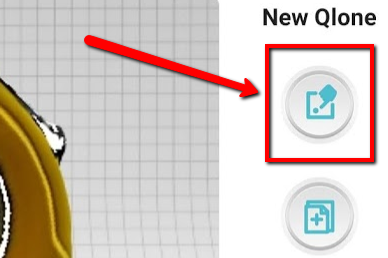

# In-Class Activity: The Basics

If you have any questions or get stuck as you work through this in-class exercise, please ask the instructor for assistance. Enjoy!

This activity will give you several options of software, apps, and web-based options for 3D scanning. Based on your device, choose the software that fits you best. 

**Softwares that work best with the camera rotating around the object**

To increase your chances of successful scans with these tools, we recommend that you take photos and videos in a 360° motion around your object 3 times or more. Each rotation around your object must be done at a consistent height and photos must overlap at least 50% to be most successful, ideally, you would rotate about 10° to 20° for each photo. In total, you should have about 100 photos of your object from all angles.  If taking a video, ensure that you rotate slowly around the object. 

Some platforms use the background in your photos to help build the 3D model, it is not necessary to have a completely solid colour background, however, to increase your chances of success, avoid scanning in an area where the background might change frequently (it is best to avoid backgrounds where people or vehicles might be moving in the space).

_Kiri Engine: Scanner 3D_ (free for download for IOS and Android devices, and available as web-based)

This tool is ideal for objects where all sides of the objects must be scanned accurately since this allows users to change the orientation of the object during the scan.

1. Download the appropriate version of the app for your device, or open the [web-based version of Kiri](https://www.kiriengine.app/web-version/Upload){:target="_blank"}. Create an account or log in. 
2. 

_Maker World AI Scanner_ (free web-based platform)

1. Take a high-quality video of your object, you should rotate around your object at least 3 times, at different angles. Make sure to complete the rotation fully before changing the camera angle. 
2. Open [Maker World AI Scanner](https://makerworld.com/en/makerlab/ai-scanner){:target="_blank"}. You do not need an account to use this platform.
3. Upload the video of your object using drag-and-drop or the import button.
4. 

**Softwares that work best when the object is rotated**

To increase your chances of successful scans with these tools, we recommend that you **take your photos or video using a high-contrast, solid background.** If needed, you can borrow the DSC's lightbox to scan your objects. 

To rotate the object you want to scan, we recommend that you use a turn table if available. This allows you to rotate the object without having to touch it, this is very important since most at-home 3D scanning technology requires the object to stay completely still to be successful. If you do not have access to a turntable, or if you need to see more surface area of your object, you can prop your object on an elevated surface (such as a glue stick or toilet paper roll). **Make sure to secure your object to your glue stick with tape or sticky tack, as your object must stay in the same position for the duration of your scan.** Rotate the glue stick to capture your object, making sure that your hand is not visible in the photos or the video. 

Take your time during the scanning phase, as this will highly impact how successful your scan is. We recommend you take about 100 high-quality photos of the object to scan. Each rotation around your object must be done at a consistent height and photos must overlap at least 50% to be most successful, ideally, you would rotate about 10° to 20° for each photo. If taking a video, ensure that you rotate slowly the object. 

_PhotoCatch_ (available on recent Mac computers, 2022 or more recent)

_Qlone_ (available for free on IOS devices)

This tool is ideal for objects where all sides of the objects must be scanned accurately since this allows users to change the orientation of the object during the scan by allowing a supplementary scan. 

1.  If you haven’t already, please [download and install](https://www.qlone.pro){:target="_blank"} Qlone on your iPhone.
2.  Pick up one of the provided checkered scanning mats (like the one pictured above right). If you are at home you can [download and print](http://bit.ly/2FV4mG9){:target="_blank"} your own scanning mat.
3.  Scan a small object (less than 10 x 10 cm):
    
    
    
    -   Select a small object and place in the center of the scanning mat.  Note: To scan a larger object, you need a larger scanning mat which can be printed on a large format printer.
    -   Launch Qlone on your phone.
    -   Press the blue **“+”** button in the bottom right corner of the screen.
    -   You should now be seeing an Augmented Reality (AR) dome on top of the object you are going to scan.
    
    
    
    -   Start scanning by pressing the **Red Record** button in the top right of the screen.
    -   You now need to either slowly move your phone around the object or rotate the mat. Make sure that the AR dome progress indicator is capturing everything it needs to.
    -   NOTE: If the VR dome disappears entirely, you probably need to move your phone further back, making sure that at least part of all 4 corners of the VR mat are visible.
    -   You will need to make four circular scans of the object at different angles to clear all of the segments in the four rings of the AR dome.
4.  Second supplementary scan. After you’ve finished the first scan you will probably notice that the scan is misshapen places. Let’s fix this:
    
    
    
    
    -   Change the orientation of your object on the VR mat (see right for an example).
    -   Click on the **White & Blue** button on the right of your Qlone screen (see the red arrow to the right).
    -   Scan the object in the same manner as you did in step 1, remember not to rush.
    
    
    
    -   When the scan is finished it will take 2 minutes for Qlone to merge the two scans together. The result should be a much higher quality scan than the first one alone.
    -   Press the **Blue arrow** button on the bottom right of the Qlone screen. You should now be back in the Gallery of Qlone.
5.  Edit the scan to smooth out a surface on the model:
    
    
    
    -   First, we need to get out of the gallery and into editing mode. Click on the gallery image of the object you scanned.
    -   Next click on the top button to the right of the photo of your scan (see image to the right). You are now in editing mode.
    -   Use two fingers on your screen to rotate around the model. You can also zoom in and out by doing a two-finger pinch.
    -   Click on the **Clean** button (1) on the top right of the screen, and then select the **Clean** (2) button to the left.
    
    
    
    -   After you enter “clean” mode, use your finger to select the area that we will smooth out. As you move your finger around the selected area will be highlighted in red (see to the right).
    -   Next, click on the **Smooth** button on the right of the screen, and then drag the slider beside it to the left to indicate to Qlone how smooth you want the area to become.
    
    
    
6.  Edit the scan to sculpt a surface of the model:
    -   Click on the **Clean** button (1) on the top right of the screen, and then select the **Sculpt** (2) button to the left.
    
    
    
    -   After you enter “sculpt” mode, use your finger to select the area that you’d like to smooth out. As you move your finger around, the selected area will be highlighted in red (see to the right).
    -   Slide the **Push-Pull** switch to the left (1) so that it is in the **Push** position.
    -   Select the **Amplitude** button (2), and then move the slider to push out the selected face as much or as little as you’d like.
    
    
    
    -   Press the large right arrow button at the bottom right of the screen to finalize the changes.
7.  **Great job!** You now have a model that you can export to the Sketchfab website or MP4 format.

[NEXT STEP: Export and Embed](act-3.html){: .btn .btn-blue }
