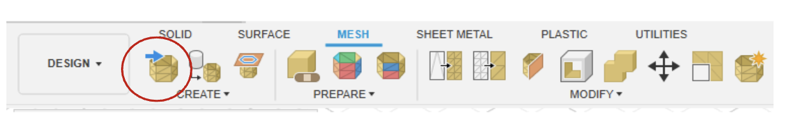
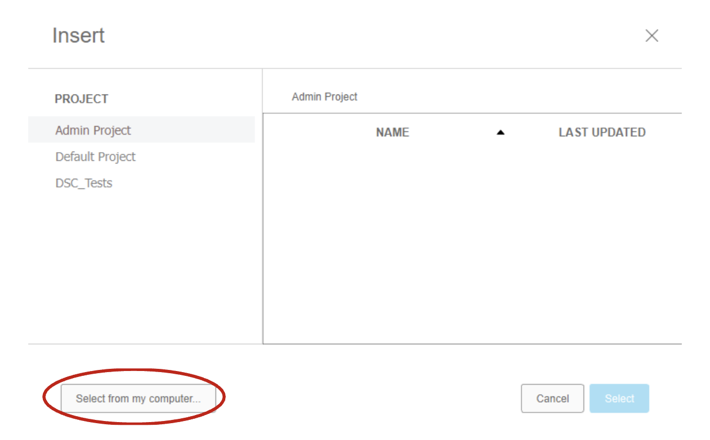

# In-Class Activity: How to fix holes and modify your design post-processing
If you have any questions or get stuck as you work through this in-class exercise, please ask the instructor for assistance. Enjoy!

1. Download Fusion 360:
- Check your laptop specifications to ensure it’s able to run Fusion 360. System requirements are listed here{:target="_blank"}
- If your computer does not meet the specifications, no worries! You can borrow a laptop from the front desk in the library and install Fusion 360.
You can obtain a free license to use Fusion 360 for personal use. Go to the Autodesk website{:target="_blank"} to make an Autodesk account and download Fusion 360
- Navigating the Fusion 360 Interface){:target="_blank"} (9 min)
<iframe width="560" height="315" src="https://www.youtube.com/embed/WKb3mRkgTwg" title="YouTube video player" frameborder="0" allow="accelerometer; autoplay; clipboard-write; encrypted-media; gyroscope; picture-in-picture" allowfullscreen></iframe>

- With a completed photogrammetry mesh saved to your files, open the Fusion 360 program. A new design workspace will open automatically. 

3. Let's now import your model as a Mesh
  - From the upper toolbar, select the Mesh category to see the relevant tools.
   
  - Click the **Insert Mesh** tool (circled) to bring your design into Fusion.  The **Select from my computer** tab will open your file explorer. Navigate to the relevant file and open it. It will appear in the Fusion workspace. From the popup menu on the right of the screen click **OK**. 
    
- The example object was scanned while propped up on a glue stick. Some of the stick was included in the scan and now needs to be trimmed off from the main object. 

4. Remove excess elements in your file
- Use the movement axes to position the object mesh vertically. Select **Plane Cut** from the toolbar. **Click your mesh** to select it as the object to be cut. 
- Three planes will appear. If your object is oriented vertically, select the horizontal plane. A large disc will appear at the midpoint of your object. From the Plane Cut menu on the right **click Flip** to invert which half of the mesh is being removed.
- Adjust the height and angle of the slicing tool to your satisfaction. Rotate your view of the object using **Shift + holding down the scroll wheel** to ensure the slicing isn’t removing too much material.

5. Close a hole in your model 
- From the **tool menu** on the right, **change the Fill Type to Uniform**. This will close the gap created by trimming and allow the mesh to be converted to a solid object. **Select OK** to complete the trim. Rotate the object to see the filled gap. 

6. Convert your mesh into a solid
- The object is now ready to be converted to a solid. From the main toolbar, click the dropdown menu on the **Modify tab**. This will display the complete list of options. **Select Convert mesh**. Leave the default settings as they appear in the menu. Ensure your mesh is selected as the object to be modified. 
- Select ‘OK’ to run the conversion. Your object now exists as a solid within Fusion.

7. Export your file
- Further edits can be made through the Solid Modify menu as necessary. When you are ready to save the object as a file, ensure it is selected. From the topmost menu, open the File dropdown and **select Export**. 
- Rename your object if needed and select the appropriate file type. For use in other 3D programs, save as a .obj file. For 3D printing, save as a .stl file. 

[NEXT STEP: Earn a Workshop Badge](informal-credentials.html){: .btn .btn-blue }
