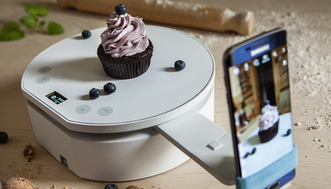

# Introduction to 3D Scanning

- Pre-workshop activities: 5 min 
- Introductory presentation: 5 - 10 min
- Hands-on activities: 50 min

## Why 3D Scanning?

3D scanning has several advantages, particularly in knowledge sharing and cultural preservation. Scanning an artifact or an object allows digital files to be rotated, zoomed in, and analyzed with great detail, across regions, and time. 3D scanning for example provides a much more immersive and detailed experience compared to a photograph of the same object since the viewer is not limited by the perspective chosen by the photographer. 

Another significant advantage of 3D scanning is the ability to 3D print replicas of artifacts or other objects. This allows for immersive knowledge sharing and can make research and history more accessible to more people. 

## Learning objectives

At the end of this workshop, you will be able to:

1.  Identify appropriate use cases for desktop and smartphone-based 3D scanning and professional archival scanning equipment.
2.  Scan a simple object using free software.
3.  Know when a second scan (different orientation) on an object would improve the quality of the final digital object.
4.  Use the Fusion 360 software to fix any holes in the scanned model.
5.  "Sculpt" or push and pull specific portions of the scanned object.
6.  Flatten the top of an appropriate object.
7.  Export the finished digital object to .stl and optionally Sketchfab.
 
[NEXT STEP: Pre-Workshop Activities](pre-workshop.html){: .btn .btn-blue }
