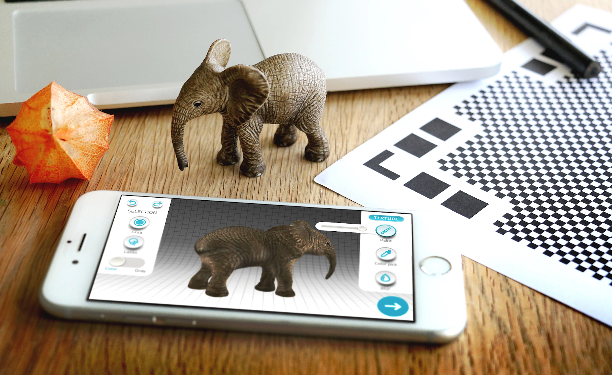

# Introduction to 3D Scanning With Qlone

- Pre-workshop activities: 5 min 
- Introductory presentation: 5 - 10 min
- Hands-on activities: 50 min

## Why Qlone? 

# **BETTER INTRO HERE**

## Learning objectives

At the end of this workshop, you will be able to:

1.  Identify appropriate use cases for smartphone-based 3D scanning and professional archival scanning equipment.
2.  Scan a simple object using Qlone on a smartphone.
3.  Know when a second scan (different orientation) on an object would improve the quality of the final digital object.
4.  Smooth a surface of a scanned object.
5.  "Sculpt" or push and pull specific portions of the scanned object.
6.  Flatten the top of an appropriate object.
7.  Export the finished digital object to MP4 and optionally Sketchfab.
8.  Embed a Sketchfab object into a Wordpress blog.
 
[NEXT STEP: Pre-Workshop Activities](pre-workshop.html){: .btn .btn-blue }
